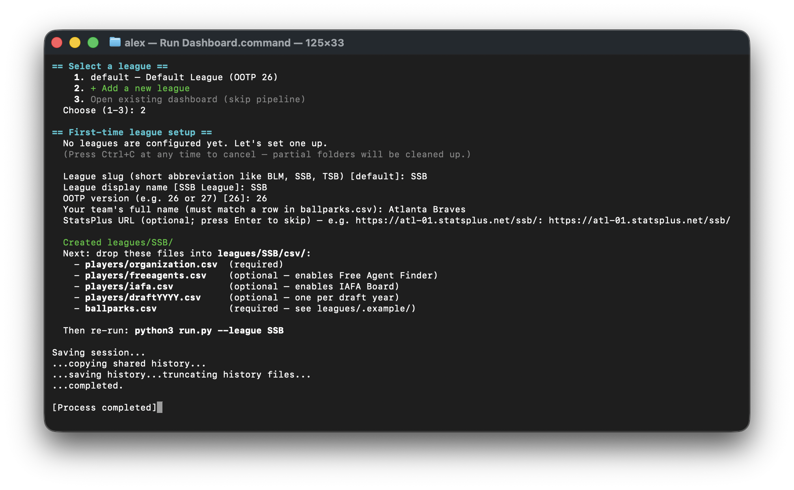

# Quickstart

A step-by-step first run, from a fresh clone to a dashboard in your browser. Should take about 3 minutes once your CSVs are exported.



## 0. Prerequisites

Install if you don't already have them:
- **Python 3.11+** — [python.org/downloads](https://www.python.org/downloads/) (during install on Windows, check "Add Python to PATH")
- **Node.js 20+** — [nodejs.org](https://nodejs.org/)

`run.py` checks both versions on launch and prints a friendly error if either is too old.

## 1. Get the project

```bash
git clone <this-repo>
cd OOTPdashboard
```

## 2. Export CSVs from OOTP

The dashboard reads CSV exports from your OOTP save. Only `organization.csv` is strictly required; the rest unlock additional views.

| File | Purpose | Required? |
|---|---|---|
| `organization.csv` | Every player in your league | **Yes** |
| `ballparks.csv` | Park factors for each team | **Yes** |
| `freeagents.csv` | Free-agent pool | Optional — enables Free Agent Finder |
| `iafa.csv` | International FAs | Optional — enables IAFA Board |
| `draftYYYY.csv` | One per draft year (any 4-digit year works) | Optional — enables Draft Board |

The full step-by-step (which OOTP report layouts to use, how to export each one) is in [`docs/OOTP_EXPORT_GUIDE.md`](docs/OOTP_EXPORT_GUIDE.md).

## 3. Run it

```bash
python3 run.py
```

Or on macOS, double-click `Run Dashboard.command` in Finder. On Windows, double-click `Run Dashboard.bat`.

### First run — set up your league

If no leagues are configured yet, you'll see a "First-time league setup" prompt:

```
== First-time league setup ==
  League slug (short abbreviation like BLM, SSB, TSB) [default]: SSB
  League display name [SSB League]: SSB Online
  OOTP version (e.g. 26 or 27) [26]: 26
  Your team's full name (must match a row in ballparks.csv): Atlanta Braves
  StatsPlus URL (optional; press Enter to skip) — e.g. https://atl-01.statsplus.net/ssb/: https://atl-01.statsplus.net/ssb/
```

After answering the prompts, the script creates `leagues/SSB/` (or whatever slug you chose) with the right subfolder structure and tells you where to drop your CSVs:

```
  Created leagues/SSB/
  Next: drop these files into leagues/SSB/csv/:
    - players/organization.csv  (required)
    - players/freeagents.csv    (optional — enables Free Agent Finder)
    - players/iafa.csv          (optional — enables IAFA Board)
    - players/draftYYYY.csv     (optional — one per draft year)
    - ballparks.csv             (required — see leagues/.example/)
```

Drop your CSVs into those folders, then re-run `python3 run.py`.

### Subsequent runs

`run.py` shows a numbered menu of leagues:

```
== Select a league ==
    1. SSB — SSB Online (OOTP 26)
    2. BLM — BLM Mainline (OOTP 26)
    3. + Add a new league
    4. Open existing dashboard (skip pipeline)
  Choose (1-4):
```

Pick one. The pipeline runs, copies the output to `app/public/data/<slug>/`, starts `npm run dev`, waits for port 3000 to come up, and opens your browser.

The dashboard remembers your selection — your team, game date, roster moves, etc. are all scoped per league, so switching between leagues via the sidebar dropdown leaves each league's state intact.

## 4. What if it fails?

`run.py` runs validation before the heavy compute, so most errors fire in under a second with an explanation. Common ones:

- **Ballpark/team mismatch** — your `ballparks.csv` doesn't list the same teams as `organization.csv`. The error names the missing/extra teams. Usually means you copied a ballparks file from another league.
- **Required file missing** — `organization.csv` isn't present. Check `leagues/<slug>/csv/players/`.
- **Your team is not listed in ballparks** — the `team` field in `league.json` doesn't match any row in `ballparks.csv`. Edit one or the other so they match.

## 5. Migrating from the legacy single-league layout

If you were running an older version of this project where data lived at `model/data/players/` and settings at `model/pipeline_settings.json`, the first time you run `python3 run.py` you'll see:

```
== Legacy settings detected ==
  Found model/pipeline_settings.json from the single-league layout.
  This can be migrated into a new leagues/default/league.json so you
  don't have to re-enter your team and StatsPlus URL.
  Migrate now? [Y/n]:
```

Answer Y. The script copies your settings into `leagues/default/league.json`, then offers to move your `model/data/players/`, `ballparks.csv`, and `metadata/` into `leagues/default/csv/` and `leagues/default/metadata/`. The original `pipeline_settings.json` is preserved in case you want to reference it.

You can rename `leagues/default/` to a slug of your choice (`SSB`, `BLM`, etc.) afterwards.

## 6. Adding a second league

From the league menu, pick `+ Add a new league` and answer the prompts. Or copy the `leagues/.example/` folder to `leagues/<your-new-slug>/` and edit `league.json` directly.

If both leagues use the same OOTP version, regression coefficients are shared automatically (same `data/regressions/ootp<version>/` folder). For a different OOTP version, see [`docs/MULTI_LEAGUE.md`](docs/MULTI_LEAGUE.md).
