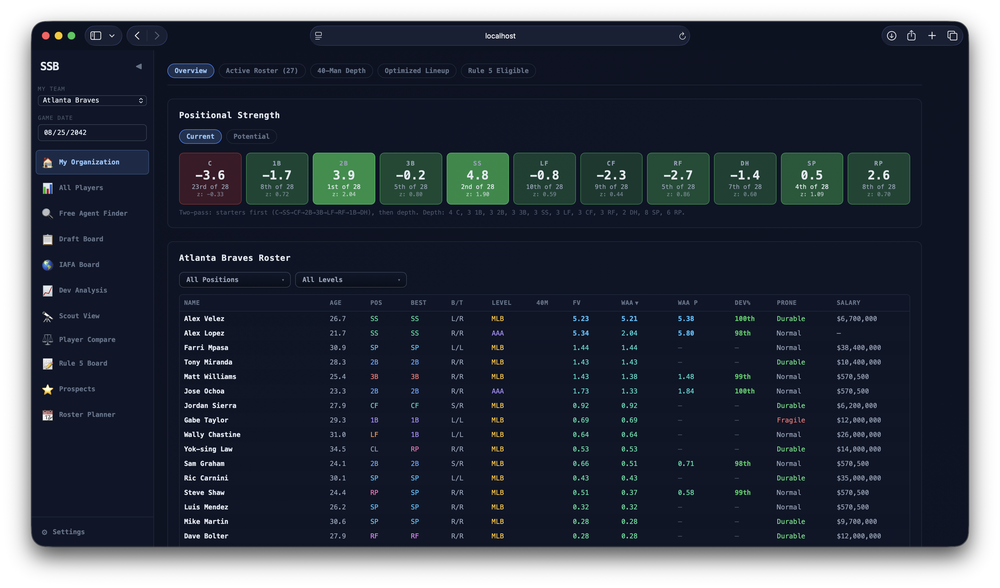
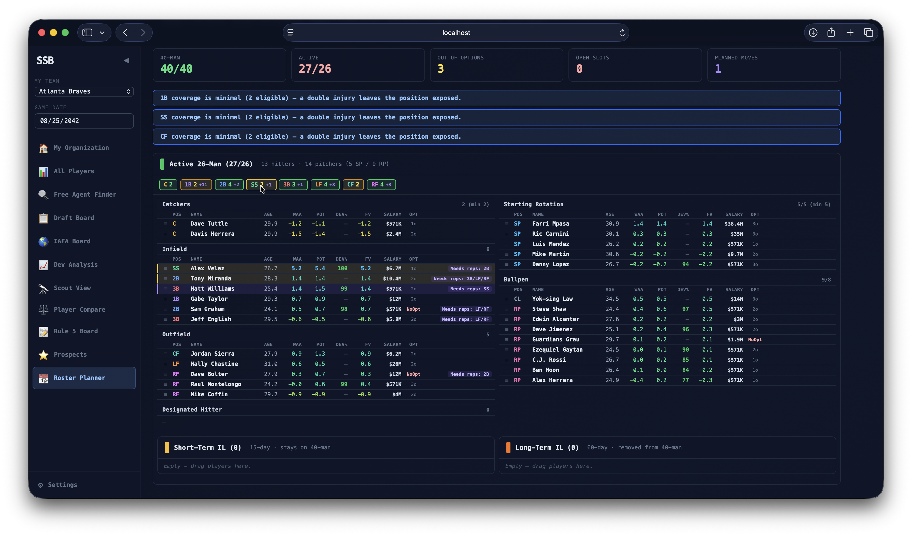
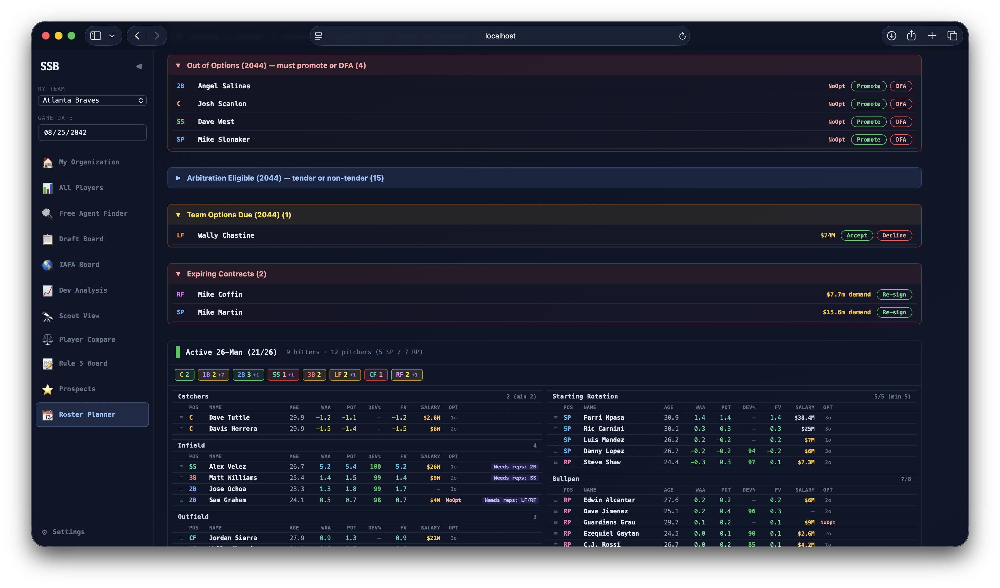
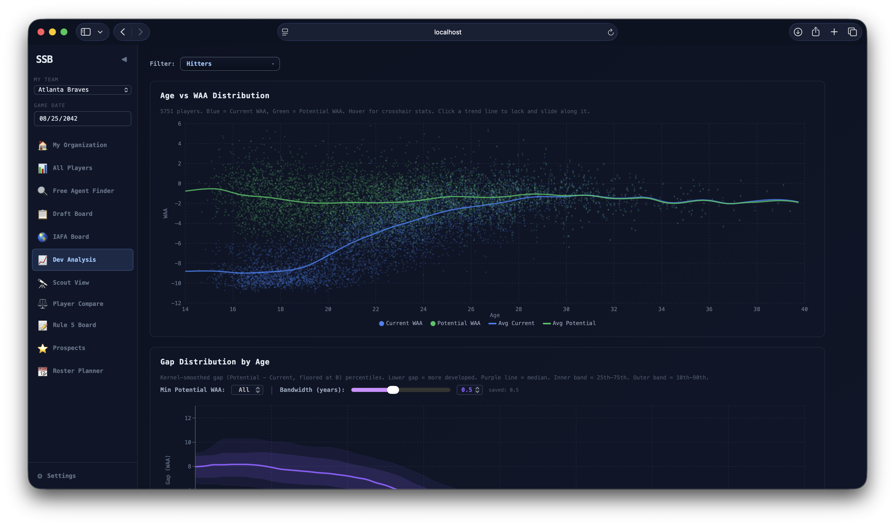
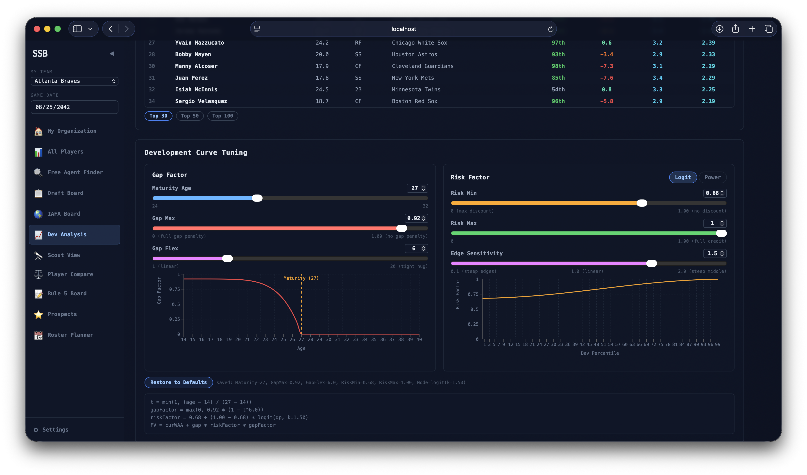
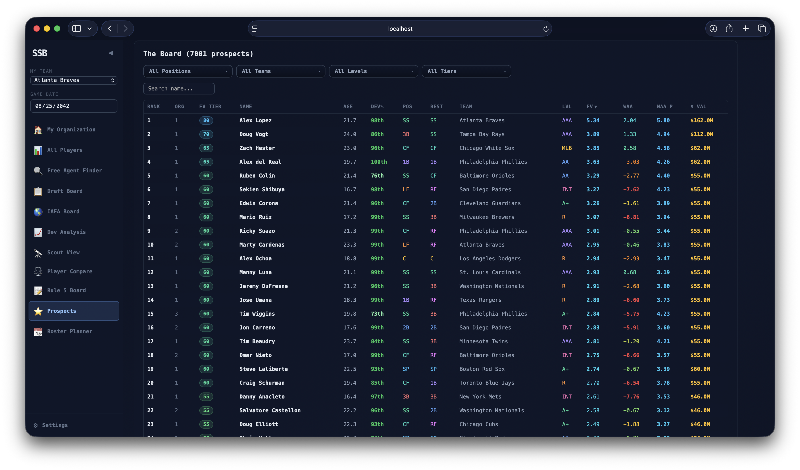
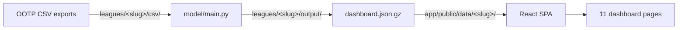

# OOTP Dashboard

[](https://github.com/ootpalex/ootp-dashboard/actions/workflows/ci.yml)
[](LICENSE)
[](https://www.python.org/downloads/)
[](https://nodejs.org/)

A multi-league analytics dashboard for [Out of the Park Baseball](https://www.ootpdevelopments.com/) online leagues. Replaces an 85 MB Excel workbook with a Python pipeline that turns raw OOTP CSV exports into WAR/WAA-based player evaluations, plus a React SPA that renders draft boards, prospect rankings, free-agent finders, roster planners, and trade-scouting tools across 11 pages.



Multiple leagues live side-by-side under `leagues/`. Regressions are calibrated per OOTP version and shared across leagues on the same version; metadata, ballparks, and outputs are scoped per league.

## Quickstart (clone to running dashboard, ~3 minutes)

1. **Clone** the repo and open a terminal in the project root.
2. **Run** `python3 run.py` (macOS users can also double-click `Run Dashboard.command`; Windows users `Run Dashboard.bat`).
3. **Follow the prompts**:
   - First-time setup walks you through naming your league, picking your team, and entering a StatsPlus URL (optional).
   - You'll be asked to drop OOTP CSV exports into `leagues/<your-slug>/csv/`. See [`docs/OOTP_EXPORT_GUIDE.md`](docs/OOTP_EXPORT_GUIDE.md) for which exports the dashboard uses.
4. **Re-run** `python3 run.py` once the CSVs are in place. The pipeline runs, the dev server starts, and your browser opens at <http://localhost:3000>.

For the full step-by-step including OOTP export instructions and screenshots, see [`QUICKSTART.md`](QUICKSTART.md).

## Tour

A few of the eleven dashboard pages:

### Roster Planner
*Drag-and-drop roster builder with multi-year contract projections, Rule 5 risk panel, and arbitration / option-decision queues.*




### Dev Analysis
*Tunable Future Value formula with live previews against your real prospect pool. Slide the curves; the rankings update in place.*




### Prospects
*Fangraphs-style prospect ranking with FV tier badges, scouting reports, and farm-system rankings.*



## Prerequisites

- **Python ≥ 3.11**
- **Node.js ≥ 20** (Vite 7 / React 18)
- **OOTP save file** — tested against OOTP 26. OOTP 27+ requires regenerating regression coefficients; see [`docs/MULTI_LEAGUE.md`](docs/MULTI_LEAGUE.md).
- *(Optional)* A StatsPlus league API URL — enables live contracts, salary reports, and draft data.

`run.py` checks all of the above on launch and prints a friendly error if anything is missing or out of date.

## Multiple leagues

Each league lives in `leagues/<slug>/`. The slug is a short abbreviation you choose (`BLM`, `SSB`, `TSB`, etc.). Layout per league:

```
leagues/<slug>/
├── league.json          # team, statsplus URL, OOTP version, etc.
├── csv/
│   ├── players/         # OOTP exports (organization.csv required; others optional)
│   └── ballparks.csv    # one row per team, with park factors
├── metadata/            # optional per-league metadata CSVs
└── output/              # auto-populated by the pipeline
```

Run `python3 run.py` to pick from a menu of configured leagues, or `python3 run.py --league <slug>` to skip the menu. The dashboard's sidebar has a league switcher when more than one league is configured. See [`docs/MULTI_LEAGUE.md`](docs/MULTI_LEAGUE.md) for adding leagues, sharing regressions across same-version leagues, and migrating to a new OOTP version.

Only `organization.csv` is required. If `freeagents.csv`, `iafa.csv`, or `draftYYYY.csv` files are absent, the corresponding views (Free Agent Finder, IAFA Board, Draft Board) hide automatically.

## Common commands

| Task | Command |
|---|---|
| Run dashboard end-to-end | `python3 run.py` |
| Build a specific league | `python3 run.py --league <slug>` |
| Just open the SPA against an existing build | `python3 run.py --skip-pipeline` |
| Re-prompt pipeline settings | `python3 run.py --configure` |
| Skip the StatsPlus network probe | `python3 run.py --skip-network-check` |
| Pipeline tests | `cd model && python3 -m pytest` |
| Frontend production build | `cd app && npm run build` |

## High-level data flow



`run.py` orchestrates the pipeline run plus the dev server. For a deeper view see [`docs/ARCHITECTURE.md`](docs/ARCHITECTURE.md).

## Troubleshooting

- **`Ballpark/team mismatch in 'leagues/<slug>/csv/ballparks.csv'`** — your ballparks file lists a different team set than `organization.csv`. The error names the missing/extra teams. Common cause: copying a ballparks file from another league.
- **`Required file missing: leagues/<slug>/csv/players/organization.csv`** — drop the `organization.csv` export from OOTP into that folder. See [`docs/OOTP_EXPORT_GUIDE.md`](docs/OOTP_EXPORT_GUIDE.md).
- **Dashboard shows the manual file-upload prompt instead of your data** — `leagues.json` or the per-league `dashboard.json.gz` is missing. Re-run `python3 run.py --league <slug>`.
- **StatsPlus contracts not loading** — your `statsplusUrl` in `leagues/<slug>/league.json` is empty or unreachable. Pipeline prints a warning and continues without it. Use `--skip-network-check` to silence the probe entirely.
- **Ages look wrong** — set the game date in the sidebar; `recomputeAges()` recomputes fractional ages from DOB.
- **A view is missing from the sidebar** — that view's CSV isn't present (e.g., no Draft Board if there's no `draftYYYY.csv`). Add the file and re-run the pipeline.

## Deeper documentation

- [`QUICKSTART.md`](QUICKSTART.md) — step-by-step first run with screenshots
- [`docs/MULTI_LEAGUE.md`](docs/MULTI_LEAGUE.md) — adding leagues, sharing regressions, OOTP version migration
- [`docs/OOTP_EXPORT_GUIDE.md`](docs/OOTP_EXPORT_GUIDE.md) — OOTP CSV export walkthrough
- [`docs/ARCHITECTURE.md`](docs/ARCHITECTURE.md) — system DAG and data flow
- [`docs/CONTRIBUTING.md`](docs/CONTRIBUTING.md) — style guide, branching, testing
- [`docs/ONBOARDING.md`](docs/ONBOARDING.md) — first-day checklist for new contributors
- [`model/docs/ARCHITECTURE_DEEP_DIVE.md`](model/docs/ARCHITECTURE_DEEP_DIVE.md) — full Excel-to-Python reference
- [`model/docs/pipelines/`](model/docs/pipelines/) — per-domain deep dives (hitters, pitchers, metadata, regressions)
- [`app/CLAUDE.md`](app/CLAUDE.md) — AI-assisted-development reference for contributors using Claude (frontend conventions, accessor rules, view-by-view notes)

## License

[MIT](LICENSE).

## Credits

Original Excel spreadsheets by **the YourKidnies**; reverse-engineered into a Python pipeline plus React SPA. The original Excel workbook README is preserved verbatim at [`docs/ORIGINAL_EXCEL_README.md`](docs/ORIGINAL_EXCEL_README.md) — the calibration philosophy described there (Regressions per OOTP version from 50 years of sim data; Metadata per league from a single year of the current league) is the same model the Python pipeline implements.

- [SOBR Discord](https://discord.gg/CjkXqWqTRn) — OOTP analytics community
