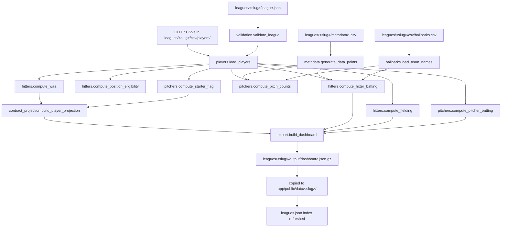
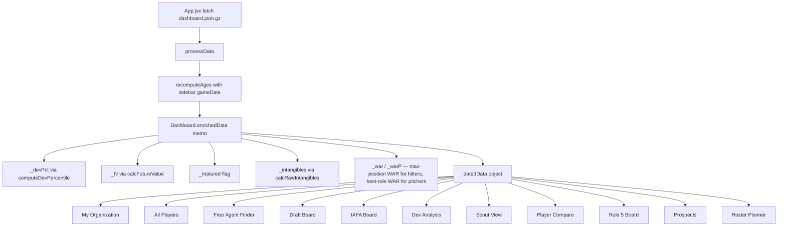

# Architecture

This document covers the cross-cutting data flow and component boundaries between the Python pipeline (`model/`) and the React SPA (`app/`). For Excel-to-Python implementation details inside the pipeline, see [`../model/docs/ARCHITECTURE_DEEP_DIVE.md`](../model/docs/ARCHITECTURE_DEEP_DIVE.md). For per-domain pipeline deep dives, see [`../model/docs/pipelines/`](../model/docs/pipelines/). For frontend accessor rules and component conventions, see [`../app/CLAUDE.md`](../app/CLAUDE.md).

## Two pillars

```
Project/
├─ model/      # Python pipeline (CSV → JSON)
└─ app/        # React Vite SPA (JSON → UI)
```

The pipeline runs once per data refresh; the SPA reads the pipeline's output as a static asset. There is no persistent backend service.

## Pipeline DAG

`model/main.py` orchestrates the pipeline; `run.py` at the project root wraps it with league selection, validation, and dev-server orchestration. The DAG below names the function entry points; the pipeline-level deep dives in [`../model/docs/pipelines/`](../model/docs/pipelines/) explain the math inside each. Paths are scoped per league — `<slug>` stands for the league's folder name (`BLM`, `SSB`, etc.).



The version-shared regression CSVs at `data/regressions/ootp<version>/` feed `regressions.generate_regression_coefficients` for OOTP-version calibration; the resulting rating→stat coefficients are computed at build time and injected into the data points (via `export._detect_metadata` → `compose_data_points`). The hardcoded constants in `data_points.py` are the fallback used when no sims are present.

Key invariants:

- `validation.validate_league` runs before any heavy compute and surfaces user-input errors (ballpark/team mismatch, missing required CSVs, unknown team) with friendly messages.
- `metadata.generate_data_points` produces calibrated league constants used by both hitter and pitcher math; the hardcoded fallback in `model/src/data_points.py` is what runs when `leagues/<slug>/metadata/` is empty.
- `ballparks.load_team_names` + the per-mode park factor builders (`neutral_*`, `team_*`, per-org future) produce a `NormalizedAdjustments` object consumed identically by hitter and pitcher batting compute.
- `export.build_dashboard` is the only writer of the JSON shape. New fields go through it. Every dashboard includes a `meta.csvPresence` block that drives view visibility on the frontend.
- `main.py` rewrites `app/public/data/leagues.json` atomically after each successful run so the SPA's league dropdown stays in sync.

## Frontend data flow



Key invariants:

- All views receive `datedData`, never raw `data`. Age recomputation is centralized.
- Computed fields (`_devPct`, `_fv`, `_matured`, `_intangibles`, `_war`, `_warP`) are added in `Dashboard.enrichedData` and read by views via accessor helpers (see [`../app/CLAUDE.md`](../app/CLAUDE.md) for the accessor list — never read flat column names directly). Hitter enrichment mirrors the pitcher pattern so `_war` / `_warP` are present on both player types — this lets the All Players mixed view render the WAR / WAR P columns it shares with the hitter and pitcher single-type views.
- **Smart-rank infrastructure is shared across boards.** Draft Board, IAFA Board, Rule 5 Board, Free Agent Finder, and Scout View all build their pools through `components/boardUtils.js:buildBoardPool` and apply `utils/futureValue.js:applySmartRank` for the per-row `_rank` value. The 4-toggle subset (Future Value / Org Positional Need / Injury Proneness / Intangibles) is identical across IAFA / R5 / Scout / FAF; Draft adds Position Caps / Min Coverage / Signability on top via its `draftContext`. Scout's "Fit" is the same additive formula — no longer an inline multiplicative calc.
- The data load is one fetch + one in-memory enrichment pass. There is no client-side caching layer beyond the browser HTTP cache and React's render memoization.

## Where to put things

| New work | Lives in |
|---|---|
| New pipeline math (rating → stat curve, new aggregation) | `model/src/<domain>.py` + paired test in `model/tests/` |
| New JSON field for the SPA | `model/src/export.py` (single writer) + accessor helper in `app/src/utils/` |
| New analysis page | `app/src/views/<ViewName>/` (post-Phase D) or `app/src/components/<ViewName>.jsx` (pre-Phase D), wired into the page switch in `Dashboard.jsx` |
| Cross-cutting helper used by ≥2 views | `app/src/utils/` or `app/src/hooks/` |
| Calibration constants from a new OOTP version | `data/regressions/ootp<new-version>/` (sim CSVs) → run `regressions.py` → update `model/src/data_points.py`. See [`MULTI_LEAGUE.md`](MULTI_LEAGUE.md). |
| Per-league metadata override | `leagues/<slug>/metadata/*.csv` (auto-detected, falls back to OOTP-version defaults if absent) |
